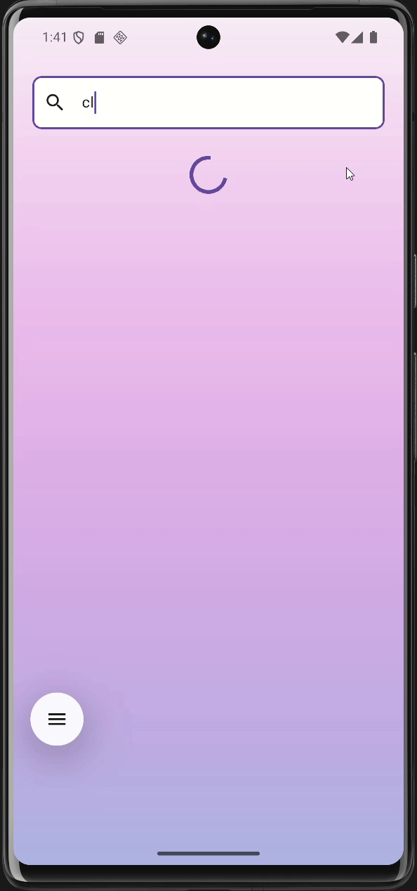

# 🌤 WeatherApp – Une application météo moderne


**WeatherApp** est une application mobile élégante développée avec **Flutter** qui permet de consulter en temps réel la météo de n'importe quelle ville dans le monde.

Au-delà d'un simple projet météo, cette application démontre une maîtrise des concepts avancés de développement Flutter avec une architecture solide et scalable.

---

##  Fonctionnalités

-  **Recherche intelligente** - Suggestions de villes en temps réel
-  **Météo détaillée** - Température, humidité, vitesse du vent, pression
-  **Performances optimisées** - Chargement rapide, states bien gérés
-  **Architecture clean** - Code maintenable et testable

## Plateformes supportées

- Android  
- iOS  

---

## Installation

1. Installer le **Flutter SDK** : [Guide officiel](https://flutter.dev/docs/get-started/install)  
2. Cloner le dépôt :  
```bash
git clone https://github.com/Serhat6863/WeatherApp.git
```
3. Accéder au dossier du projet et installer les dépendances :
```bash
cd myapp
flutter pub get
```
4. Générer le code nécessaire (Retrofit, JSON, etc.)
```bash
 flutter pub run build_runner build --delete-conflicting-outputs
```
5. Run the app on your desired platform:
```bash
flutter run
```

---


## Prérquis 
- Flutter SDK ≥ 3.7.2
- Dart SDK ≥ 2.19
- Android Studio / VS Code avec extension Flutter
- Émulateur iOS/Android ou appareil physique

---

## Exécuter un test
-Pour executer un test 
```bash
flutter test
```

---

## Usage

Cette section vous guide à travers les fonctionnalités principales de WeatherApp.

### Premier lancement
Après l'installation de l'application, vous verrez un écran principal avec une barre de recherche pour trouver la météo de n'importe quelle ville.  

1.Tapez sur la barre de recherche.

2.Entrez le nom de la ville.

3.Sélectionnez la ville dans la liste d’autocomplétion.

4.La météo actuelle s’affiche avec : température, humidité, vitesse du vent et pression.

5.Faites défiler pour voir les prévisions des prochains jours.

---


## 📱 Captures d’écran et Démonstration

### Écran principal & Recherche d'une ville
<p align="center">
  
  
</p>

### Prévisions météo & Démonstration vidéo
<p align="center">
  
  
</p>


## 🏗️ Architecture du projet

Voici l’arborescence du projet **WeatherApp** :

```bash
WeatherApp/
├── android/                     # Configuration Android
├── ios/                         # Configuration iOS
├── lib/                         # Code source principal
│   ├── core/                    # Constantes, helpers, utils partagés
│   │   └── constants.dart       # Fichier contenant les constantes globales
│   ├── features/                # Fonctionnalités de l'application
│   │   └── weather/             # Module météo : data, domain, presentation
│   ├── data/                    # Modèles et sources de données (API)
│   ├── domain/                  # Entités et use cases
│   ├── presentation/            # UI, widgets, pages
│   └── main.dart                # Point d'entrée de l'application
├── test/                        # Tests unitaires et d'intégration
│   └── features/                # Tests par fonctionnalité
├── screenshots/                 # Captures d’écran utilisées dans le README
├── pubspec.yaml                 # Dépendances du projet
└── README.md                    # Documentation principale

```

- `core/` : contient les utilitaires, helpers, constantes partagés dans l’appli  
- `features/weather/` : tout ce qui est lié à la fonctionnalité météo  
- `presentation/` : écrans, widgets, interface utilisateur  
- `domain/` : logique métier, entités, cas d’usage  
- `data/` : récupération des données (API, services externes, parsing JSON)  
- `test/` : tests unitaires et d’intégration  
- `screenshots/` : captures d’écran utilisées dans le README  

---


