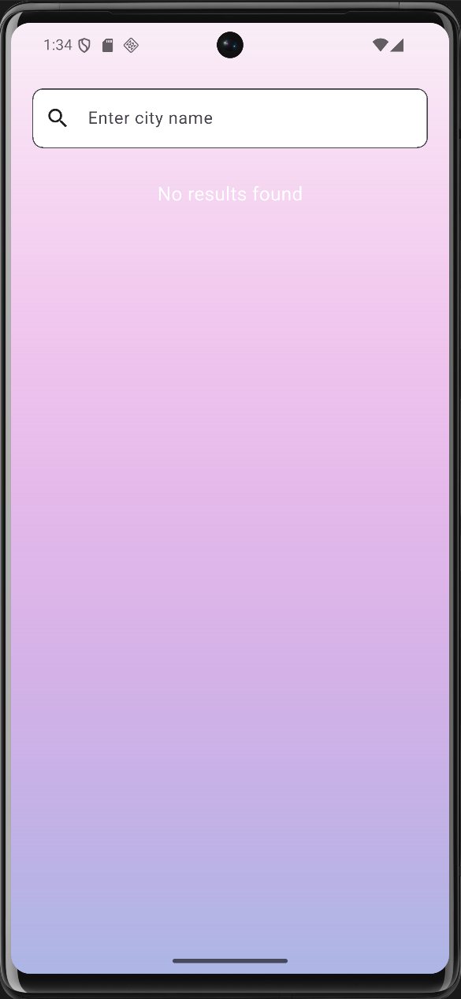
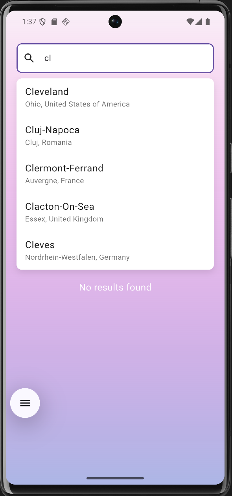
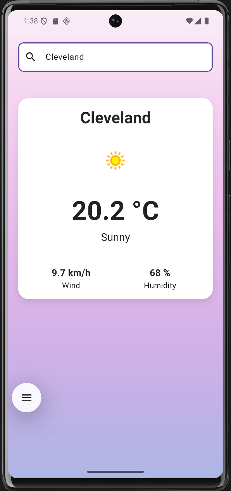

# WeatherApp – Une application météo simple

**WeatherApp** est une application mobile développée avec **Flutter** qui permet de consulter en temps réel la météo d’une ville choisie.  

Au-delà d’un simple projet météo, cette application m’a permis de mettre en pratique plusieurs concepts clés avec Flutter :  

-  **Intégration d’API externes** avec **Retrofit**  
-  **Gestion d’état** avec **BLoC**  
-  **Clean Architecture** et structuration du code avec **build_runner** & **json_serializable**  

---

## Plateformes supportées

- Android  
- iOS  

---

## Installation

1. Installer le **Flutter SDK** : [Guide officiel](https://flutter.dev/docs/get-started/install)  
2. Cloner le dépôt :  
```bash
git clone https://github.com/Serhat6863/WeatherApp.git
```
3. Accéder au dossier du projet et installer les dépendances :
```bash
cd myapp
flutter pub get
```
4. Générer le code nécessaire (Retrofit, JSON, etc.)
```bash
 flutter pub run build_runner build --delete-conflicting-outputs
```
6. Run the app on your desired platform:
```bash
flutter run
```


## Prérquis 
- Flutter SDK version 3.7.2 ou supérieure
- Android Studio / Xcode pour émulateurs ou appareils réels

## Exécuter un test
-Pour executer un test 
```bash
flutter test
```


## Usage
Cette section vous guide à travers les fonctionnalités principales de WeatherApp

**Premier lancement**
Après l'installation de l'application, vous verrez un écran principale avec une barre de recherche pour trouver la méteo de n'importe qu'elle ville
1. Tapez sur la barre de recherche
2. Tapez le nom de la ville
3. Selectionnez dans la liste d'autocomplétion
4. la météo s'affiche

## Captures d'écran et démonstration

### Écran principal*


### Recherche d"une ville


### Prévisions météo


### Démonstration Video


